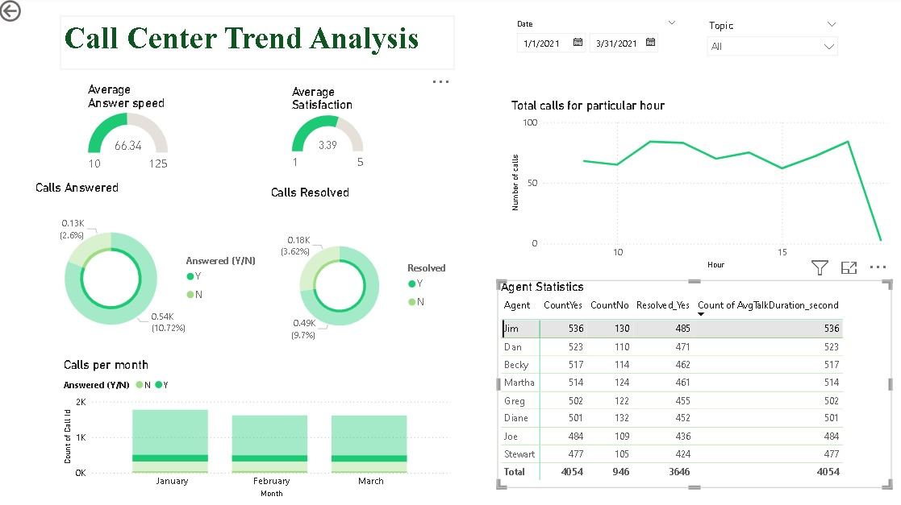

# PowerBI Dashboard project for PWC virtual internship

This repository is a part of PWC virtual internship and it aims to create a well designed PowerBI dashboard to meet client's information required for call center trend data analysis, customer retention programme, diversity and inclusitivity program.

---

## Instructions for view PowerBI file
1. Install the latest version of PowerBI desktop 
2. The project file `file_name.pbix` has the PowerBI file and the `file_name.pdf` to show pdf version for easy visualization of project

---
## Call center trend data analysis

* Gauge Charts: The gauge charts display the speed at which queries were answered and customer satisfaction levels.
* Donut Charts: The donut charts show the percentage of calls answered and resolved.
* Bar Chart: The bar chart illustrates the number of calls answered for each month.
* Line Chart: The line chart displays the timings of when agents were called to address queries.
* Agent Statistics Table: The table provides a detailed view of all agents, including relevant information such as calls answered and duration. 

The slicers and agent statistics table are used to select specific date, agent name and branch of the agent. This further changes the visualization for each different selection.

---
## Credits

This project completely belongs to PWC virtual internship experience and the dataset is collected from PWC website.

Resources:
- Learnit Training PowerBI youtube course https://www.youtube.com/watch?v=e6QD8lP-m6E

