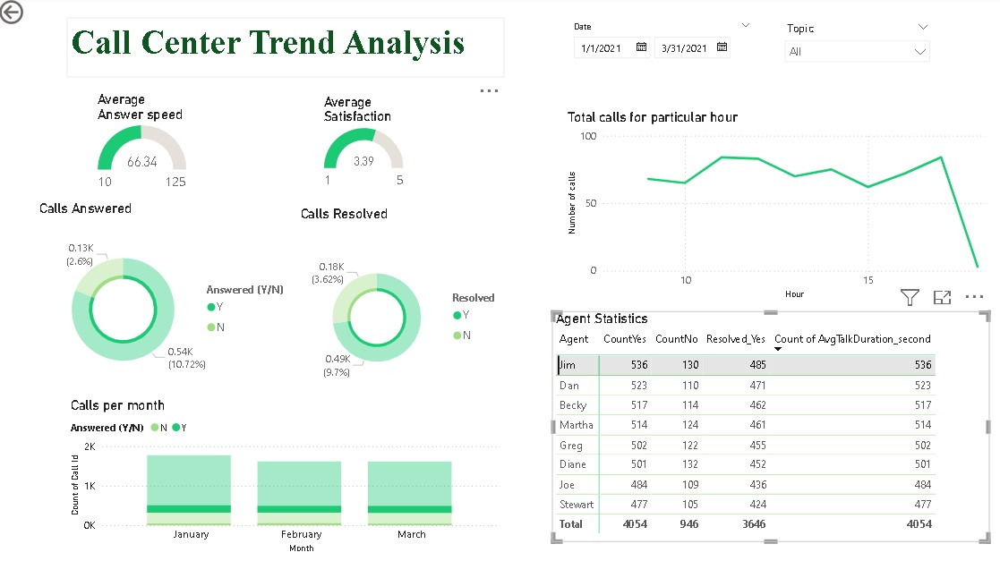
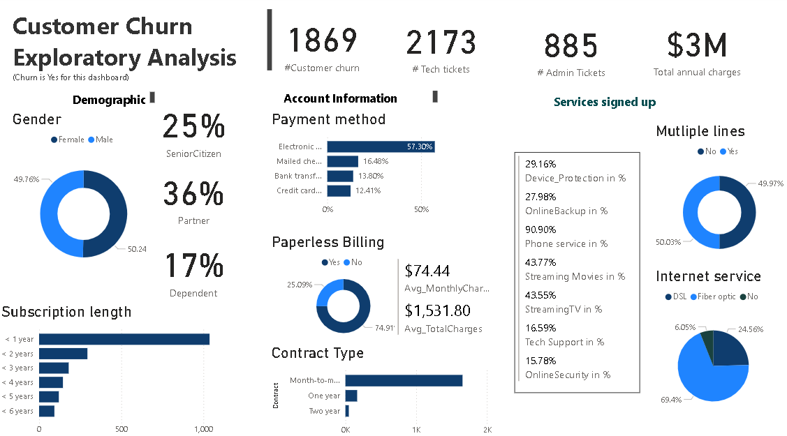
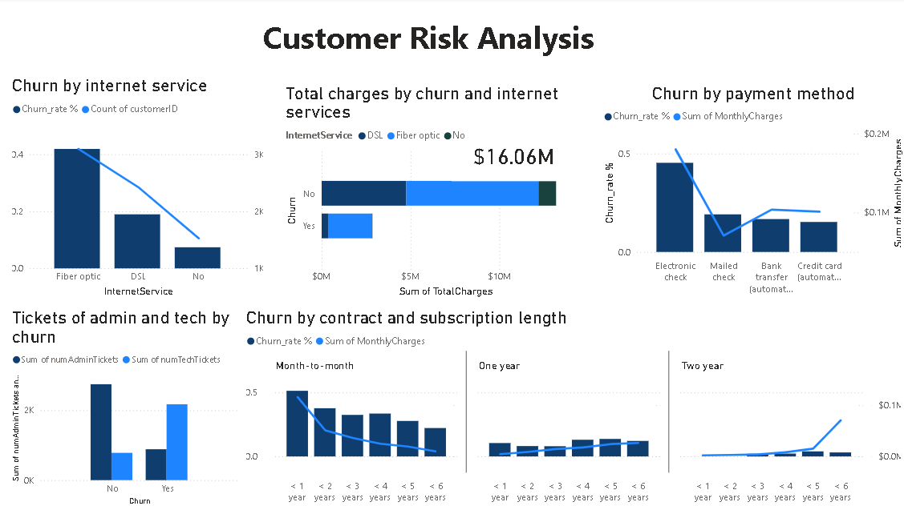
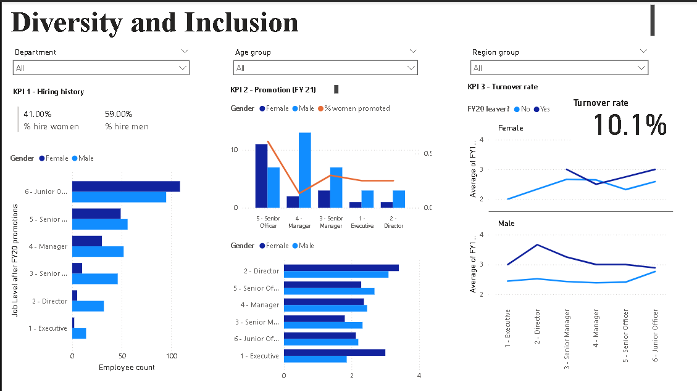
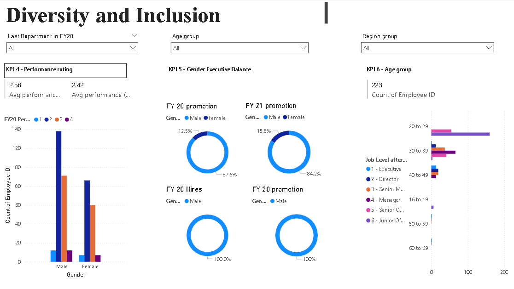

# PowerBI Dashboard project for PWC virtual internship

This repository is a part of PWC virtual internship and it aims to create a well designed PowerBI dashboard to meet client's information required for call center trend data analysis, customer retention programme, diversity and inclusitivity program.

---

## Instructions for view PowerBI file
1. Install the latest version of PowerBI desktop 
2. The project file `file_name.pbix` has the PowerBI file and the `file_name.pdf` to show pdf version for easy visualization of project

---
## Call center trend data analysis

## Customer retention dashboard

## Diversity analysis dashboard

---
## Credits

This project completely belongs to PWC virtual internship experience and the dataset is collected from PWC website.

Resources:
- Learnit Training PowerBI youtube course https://www.youtube.com/watch?v=e6QD8lP-m6E
